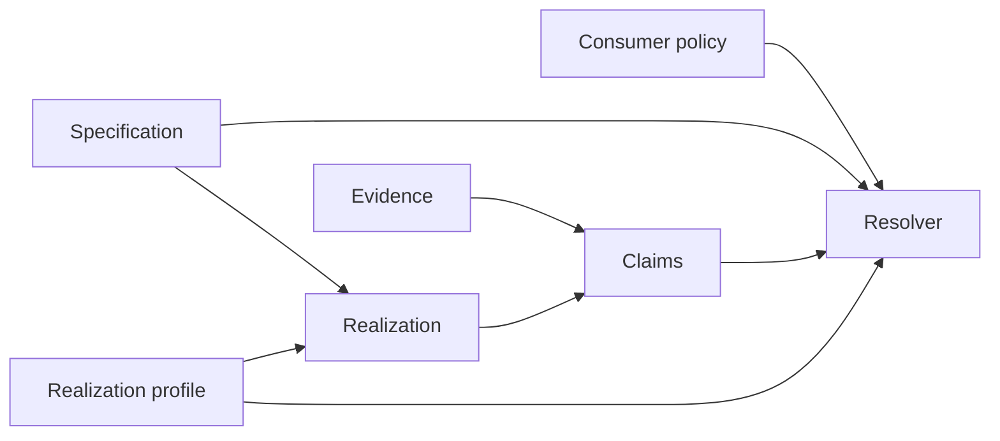

# Architecture

## Core proposition

A conventional package distributes an implementation and a shallow interface. This project separates five concerns:

## Core entities

### Specification

Defines vocabulary and observable meaning:

- types or carriers;
- operations and observations;
- laws and invariants;
- state transitions and protocols;
- required, permitted, optional, and forbidden effects;
- user-defined resource obligations;
- optional performance and empirical claims.

It must avoid unnecessary commitments to layout, algorithms, ownership mechanisms, runtimes, or languages.

### Realization

A concrete implementation of a specification. It records:

- implementation language and version;
- target platform and runtime;
- ABI/component/interface mechanism;
- build and execution instructions;
- declared capabilities and limitations.

### Claim

A scoped proposition about a specification or realization, including assumptions and exclusions.

### Evidence

An artifact supporting a claim:

- proof;
- conformance test result;
- property/model/differential test result;
- fuzzing campaign;
- benchmark;
- audit;
- assertion.

Evidence mechanisms are not interchangeable and must remain visible.

### Realization profile

The execution envelope: platform, host capabilities, scale, latency, memory, concurrency, trust, and portability constraints.

### Consumer policy

The subscriber's required and preferred semantic concerns, evidence levels, effects, resources, performance, and interoperability costs.

## Two compatibility relations

### Semantic compatibility

Whether a realization satisfies the required observable contract, possibly by refinement rather than exact equality.

### Realization compatibility

Whether selected realizations can be combined efficiently and safely: same ecosystem, compatible ABI, shared runtime, FFI, Wasm component boundary, or process/message boundary.

These relations must never be conflated.

## Trust boundary

The first trusted computing base should be small:

- parser and schema validator;
- claim/evidence graph checker;
- selected proof assistant kernel when proofs are used;
- conformance runner;
- registry provenance mechanism.

The web UI and implementation code are not inherently trusted.
