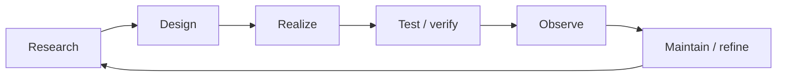

# Product and agent lifecycle

## Governance layers

| Layer | Agent authority |
|---|---|
| constitution and mission | propose only; human approval required |
| semantic specification | modify through reviewed proposal |
| implementation and adapters | autonomous within contract |
| tests/evidence generation | autonomous; may not erase failures |
| development process | experiment within constitutional limits |

## Quality gates

1. **Intent gate** — observable outcome and non-goals are explicit.
2. **Specification gate** — claims are scoped and testable; representation is not unnecessarily fixed.
3. **Realization gate** — build succeeds and adapters expose the declared vocabulary.
4. **Evidence gate** — each required claim has acceptable evidence or is marked unknown.
5. **Integration gate** — semantic and realization compatibility are independently checked.
6. **Release gate** — result is reproducible and reversible where applicable.
7. **Learning gate** — discoveries update plans, backlog, and design decisions.

## Recursive improvement

Process changes must themselves be treated as experiments with hypothesis, baseline, target, trial scope, observed result, and rollback. Agents may improve execution strategy but cannot redefine governing success criteria.
