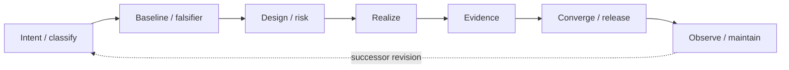

# Product and agent lifecycle



This is a common evidence-bearing spine, not a mandatory serial waterfall. Research,
normative documentation, design, implementation, verification, and observation may
overlap where their ownership permits. A failed or revisited gate creates a successor
DAG node and reopens affected downstream acceptance; it does not rewrite history.

## Governance layers

| Layer | Agent authority |
|---|---|
| constitution and mission | propose only; human approval required |
| semantic specification | modify through reviewed proposal |
| implementation and adapters | autonomous within contract |
| tests/evidence generation | autonomous; may not erase failures |
| development process | experiment within constitutional limits |

## Director, product lead, and crew

Authority follows the artifact layer, not seniority:

| Role | Authority and duty |
|---|---|
| director / user | owns mission, protected intent, product priority, and approval of consequential scope changes |
| product lead / integrator | frames work, delegates bounded authority, maintains the ExecPlan, reconciles concerns, verifies evidence, and accepts integrated results |
| specialist crew | owns a delegated concern or artifact, implements within the approved contract, and challenges assumptions with evidence |
| reviewer / skeptic | independently attempts to falsify the result and audits cross-concern boundaries; this is a task-specific role, and evidence—not reviewer status—carries weight |

The product lead may decide reversible implementation choices inside the accepted
design. The lead may not redefine success, weaken protected requirements, or treat an
agent report as acceptance evidence. Constitution, mission, product-priority tradeoffs,
and hard-to-reverse universal foundations remain with the user.

### Work-dependency DAG

Treat each plan revision as a finite directed acyclic graph. The product lifecycle may
loop over time, but correction creates a successor revision node rather than a
back-edge; prior decisions, evidence, failures, and dissent remain inspectable. The DAG
models readiness and artifact flow, not rank or every deliberation. Roles are temporary
assignments on nodes, and graph centrality confers no authority.

| Node type | Function and closure |
|---|---|
| governing decision | records an accepted constraint, option, or authority-layer decision; closes through its named authority |
| bounded work package | produces a defined artifact or observation within exclusive scope; closes against its delegation contract |
| concern / evidence | supports, challenges, or qualifies affected packages or gates; contradictory and unresolved results remain attached |
| convergence gate | fans in required artifacts, evidence, reviews, and concern dispositions; releases only declared dependent nodes |

| Edge type | Meaning |
|---|---|
| `authorizes` | passes bounded authority without widening the upstream grant |
| `depends-on` | names a hard readiness prerequisite |
| `supports` / `challenges` | carries evidence or lateral concern influence without transferring ownership |
| `integrates-into` | contributes to a shared artifact controlled by its named integrator |
| `escalates-to` | creates a decision node at the required authority layer |

Only `depends-on` readiness edges must be acyclic. Review, feedback, and escalation may
point upstream. Each active node names one accountable owner, one acceptance or
integration owner, governing artifact revisions, exclusive write scope, required
evidence, and stop conditions; contributors and reviewers may be plural. Consequential
or gate-closing nodes require independent review, while routine reversible nodes may
close through predeclared checks and lead verification.

If a hard dependency cycle appears, stop the affected nodes and extract their shared
uncertainty into an earlier decision or falsifier node. A relevant predecessor, gate,
or governing artifact change reopens downstream acceptance until its evidence is
rerun. Reviewers have no unexplained standing veto, but supported material objections
must receive an explicit disposition.

### Model and provider diversity

Different models or providers may own independent concern, implementation, or review
nodes to reduce correlated blind spots. Diversity is a probe, not an assurance level:
compare propositions, artifacts, and evidence rather than model reputation or vote
count. All providers inherit the same bounded authority and acceptance gates.

The versioned capability matrix, secure command patterns, and evidence-packet fields
live in the [multi-provider workflow](../operations/multi-provider-workflow.md). Treat
that runbook as current operational memory and re-probe environment-dependent facts.

Record provider/model/tool provenance when it affects reproducibility or explains an
independent review. Sending repository material to an external provider requires the
applicable data-sharing authority; a locally hosted model is preferred when that
authority is absent. Provider unavailability must not block unrelated DAG nodes.

Model selection is an execution-profile annotation on a work, consultation, or review
node. It is not a node type, authority edge, or assurance grade. A consultation normally
connects through `supports` or `challenges`; make it a hard `depends-on` predecessor
only when the governing brief says the decision cannot safely proceed without it.
Substitution or fallback creates recorded reassignment provenance rather than a silent
downgrade.

Cross-provider children run only through `agent-dispatch`, which preserves bounded
delegation depth and narrows children into the configured sandbox. Use read-only mode
for consultation and skepticism. Writable execution requires an isolated worktree or
otherwise verified exclusive directory, because a semantic path boundary in a brief is
not an operating-system write boundary. Read-only prevents mutation, not disclosure;
record and authorize the repository scope visible to any external provider.

An observable terminal control plane such as Herdr may create panes, report status,
carry interaction, and organize worktrees around dispatched processes. It is not the
execution or security boundary: its ability to launch arbitrary host processes means
the control socket and control environment remain lead-side and never enter a child
sandbox. The child remains observable through its managed PTY; all provider launches
still pass through the dispatcher.

### Delegation contract

Every delegated brief states:

1. observable outcome and non-goals;
2. governing documents, invariants, upstream dependencies, and downstream convergence gate;
3. accountable owner, contributors or reviewer, authority boundary, and exclusive writable paths;
4. forbidden semantic changes;
5. smallest probe or negative case that could refute the premise;
6. required artifacts, commands, and expected observations;
7. stop and escalation conditions.

Every handoff returns changed artifacts, commands and exit results, positive and
negative observations, assumptions, exclusions, retained failures, unresolved
concerns, and discoveries that require an ExecPlan or ADR update. Parallel writers use
disjoint ownership. The named integrator owns each shared surface, the gate owner
verifies its evidence, and the lead audits consequential or shared-surface convergence.
Routine reversible nodes close through their predeclared checks without lead approval.

When model or tool choice matters, the evidence packet also records the node ID and
revision, requested provider/model and runtime-resolved identifier, explicit effort,
dispatcher and agent-tool versions, sandbox and PWD mode, worktree and write scope,
network/disclosure scope, prompt or brief revision, fallback or retry, and reviewer
provenance. Hidden reasoning and model self-identification are not evidence; retain
concise rationale, falsifiers, artifacts, commands, and observations instead.

### Consequential decision deliberation

The team optimizes for reasoned convergence, not unanimity:

1. The lead frames the decision, authority layer, options, reversibility, and decisive evidence.
2. Relevant concerns prepare independent briefs before being anchored on a preferred answer.
3. The lead maps disagreement as fact/feasibility, requirement interpretation,
   policy/priority, implementation tradeoff, or unknown scope.
4. Cross-reviewers steelman material objections and audit for silent requirement
   weakening, representation leakage, erased evidence, compatibility conflation, and
   hidden universal commitments.
5. The team runs the cheapest decisive falsifier. Within delegated authority, the
   lead chooses the smallest reversible option that preserves the long-term vision.
6. Every material concern is disposed as incorporated, falsified with evidence,
   accepted risk, deferred with an owner/trigger, or escalated to the user.

Do not vote, average agent confidence, or claim consensus merely because work must
continue. Record a minority report when dissent alleges a protected-boundary breach,
contradictory evidence, two plausible readings of an observable requirement, a
hard-to-reverse choice, or a need for human escalation. Decisions are labeled
accepted, experimental, deferred, escalated, or decided with dissent, with the
observation that would reopen them.

## Project knowledge topology

Project memory is classified by durability so agents do not mistake yesterday's
status for a timeless contract:

| Kind | Repository home | Maintenance rule |
|---|---|---|
| protected intent | `docs/vision/constitution.md` | change only with explicit human review |
| current architecture and semantics | `ARCHITECTURE.md`, `docs/design/` | describe the present design; consequential forks get ADRs |
| accepted decisions | `docs/decisions/` | append or supersede; retain rationale and rejected alternatives |
| operational runbooks | `docs/operations/` | record current verified tool behavior; re-probe versioned facts and preserve security invariants |
| active work and discoveries | `docs/exec-plans/active/` | living state; move the current edge rather than accumulating history |
| future work | `tasks/backlog.md` | revisable and ordered by dependency/evidence |
| completed history | completed ExecPlans and git | do not duplicate as current-state prose |
| product projections | registry indexes, browser/API views | generate or check from canonical records |

The repository is intentionally too small for a separate volatile `CONTEXT.md` or
generated documentation indexes. Add those only when multiple concurrent plans or
enough derived documents make drift observable.

## Quality gates

1. **Intent gate** — observable outcome and non-goals are explicit.
2. **Specification gate** — claims are scoped and falsifiable; abstract equality and
   observation are defined; representation is not unnecessarily fixed.
3. **Realization gate** — build succeeds and adapters expose the declared vocabulary.
4. **Evidence gate** — positive and negative fixtures execute; each required claim has
   acceptable, applicable evidence or is reported as unmet; contradictory results are retained.
5. **Integration gate** — semantic and realization compatibility are independently checked.
6. **Release gate** — result is reproducible and reversible where applicable.
7. **Learning gate** — discoveries update plans, backlog, and design decisions.

A gate is executable when practical and records its command, inputs, expected
observation, and result. Failing a gate may change the implementation or produce a
governed requirement proposal; it may not silently weaken the acceptance condition.

## Scaled change profiles

Every change retains an observable goal, baseline or explicit reason one is not
meaningful, relevant verification, adverse observation where practical, assumptions
and exclusions, recovery path, result, and reopen trigger. Risk scales the breadth,
independence, environments, rollout controls, and artifact weight; it never permits no
evidence. See [ADR 0011](../decisions/0011-scaled-change-lifecycles.md).

| Change class | Required emphasis and proportional path |
|---|---|
| feature | complete an actor-visible journey through research, semantic design, realization, verification, documentation, release, and maintenance ownership |
| defect | reproduce the accepted-behavior deviation, retain the failing input, fix minimally, add regression and adjacent boundary evidence, then observe release |
| improvement | state the affected journey, baseline, target, and comparative result; reclassify as a feature when the contract or user capability changes |
| refactor | characterize observable behavior, demonstrate useful test sensitivity, change structure reversibly, and show semantic equivalence with broader gates |
| optimization | measure the named workload/profile first, preserve semantic and safety obligations, compare against a quantitative target, and retain trade-offs; “not justified” is valid |
| dependency/toolchain | pin old/new provenance, review compatibility, supply chain and licenses, rerun tool-scoped Evidence, and retain rollback |
| migration or deprecation | inventory affected state and consumers, rehearse integrity and mixed-version behavior, provide migration/recovery, and remove only through a later gate |
| security or operational incident | contain and preserve evidence first, scope impact, remediate, independently review, stage recovery, monitor, and complete a successor investigation |
| experiment | bound the hypothesis, baseline, falsifier, isolation, duration, kill criteria, and rollback; promotion enters the appropriate production lifecycle |
| documentation/specification | check descriptive truth; treat normative meaning or compatibility changes as specification/feature/migration work rather than “docs only” |
| release/configuration | name rollout scope, canary, observability, rollback trigger, and post-release verification |
| governance/self-improvement | run a bounded process experiment with independent review and no self-ratification or protected-gate weakening |

Escalate based on protected or normative semantics, shared surfaces, external-state or
data mutation, security/privacy, irreversibility, universal/statistical claims,
checker trust, or user-visible compatibility—not raw line count.

### Refute-first implementation loop

Inside a bounded work package, use:

```text
frame -> red/refute -> minimal green -> refactor/reconcile
      -> broader verification -> evidence packet -> observe/reopen
```

“Red” is an observed unmet claim, not necessarily a unit test. A defect normally starts
with a reproducing regression; a feature slice with a failing journey scenario; a pure
refactor with characterization and sensitivity controls; an optimization with a
measured deficit; and a proof with a counterexample attempt and proof check. Security
containment may precede safe regression authoring.

Keep these micro-stages inside the package unless one releases another owner, creates
a reusable falsifier or shared contract, changes a shared surface, produces canonical
Evidence, crosses an authority/irreversibility boundary, or needs independent review.

## Feedback-loop ladder

Use the cheapest loop that can falsify the current claim:

| Grade | Cadence | Current or planned observation |
|---|---|---|
| G0: repository | every documentation change | required files, links, and structural consistency |
| G1: records | every schema/fixture change | schema validation, negative fixtures, reference integrity |
| G2: semantics | every realization/evidence change | proof check, conformance, counterexamples, provenance |
| G3: tracer/release | milestone close | full lifecycle, compatibility explanations, fresh-clone reproduction |

An artifact moves from prose to a stronger rung when it becomes derivable: generate a
projection from its canonical records or encode an invariant as a check. Do not build
generation machinery before there is a duplicated fact to eliminate.

## Refute-first work units

Before investing in a schema, proof integration, adapter, or compatibility rule,
construct the smallest negative fixture or probe that could disprove its premise.
A useful counterexample or a rejected design route is a first-class result and belongs
in the active ExecPlan so later agents do not repeat the same investigation.

## Recursive improvement

Process changes must themselves be treated as experiments with hypothesis, baseline,
target, canary scope, safety invariants, observation window, independent review, and
rollback. Agents may improve execution strategy but cannot redefine governing success
criteria, weaken protected gates, pass earlier work retroactively, or ratify their own
consequential governance changes. Gate changes apply to successor nodes and preserve
the prior result. Constitutional or hard-to-reverse amendments require user approval.
