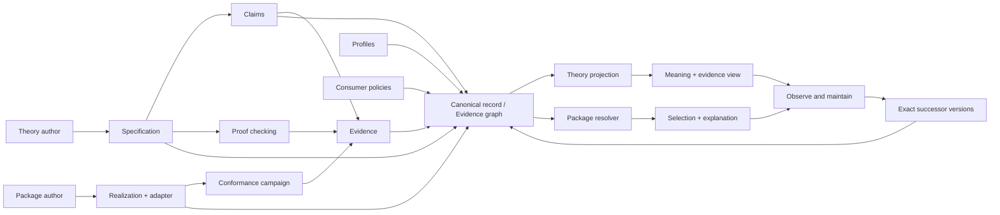

# Tracer system map

## Purpose and authority

This document is the revisable end-to-end map of the current system. It explains how
the product data plane, product decision plane, and project/agent control plane connect
across tracer increments. It is a derived orientation document: normative semantics
remain in the concern documents, accepted forks in ADRs, and live completion status in
the active ExecPlan.

| Question | Authoritative source |
|---|---|
| protected mission and product outcome | [constitution](../vision/constitution.md) |
| entities, identity, observation, Claims, Evidence, profiles, and policies | [core model](core-model.md) |
| proof/test/review/result/assurance distinctions | [evidence model](evidence-model.md) |
| semantic resolution versus directional interoperation | [compatibility](compatibility.md) |
| executable Stack process boundary | [adapter protocol](adapter-protocol.md) |
| work DAG, delegation, gates, and change profiles | [lifecycle](lifecycle.md) |
| Waves 1–4 node status, failures, evidence, and counts | [ExecPlan 0001](../exec-plans/active/0001-tracer-bullet.md) |
| actor-journey and governance successor status | [ExecPlan 0002](../exec-plans/active/0002-actor-journeys.md) |

## End-to-end product shape



Solid incoming graph edges exist as canonical record forms today. Proof checking,
child-process conformance, reviewed Rust/TypeScript Evidence, and the finite Stack
theory-publication inspection are executable. Package registration and convergence of
the full curated product graph remain next; resolver, consumer projections, and the
maintenance loop are designed but not yet executable.

For the tracer, **registry** means one curated finite local source set of immutable
exact-version records. It does not yet mean hosted acquisition, authentication,
indexing, version discovery, remote execution, or production registry security.

## System planes

### Product data plane

The data plane carries Specifications, Realizations, Claims, Evidence, profiles,
policies, proof artifacts, conformance requests/responses, observations, reports, and
exact typed references.

Its current executable runtime loop is:

```text
immutable conformance plan
  -> NDJSON adapter requests
  -> Realization observations and reported events
  -> declaration-level outcomes
  -> reproducible campaign report
```

The report is an observation artifact, not self-ratifying Evidence.

### Product decision plane

The product decision plane determines which data is coherent and what may be concluded:

- schemas and exact-address loading/linking;
- proof and conformance checkers;
- Claim/Evidence scope, provenance, and review binding;
- consumer policy and profile applicability;
- semantic resolution and directional realization compatibility;
- freshness, successor, retirement, and recovery rules.

The decision plane must bind a report to the exact Specification, Claim, Realization,
adapter, profile, plan, source, toolchain, review, assumptions, and exclusions before
it can contribute assurance. Graph validity remains distinct from evidence acceptance,
applicability, result, policy satisfaction, and selection.

### Project and agent control plane


The user owns protected intent. The lead frames dependencies, delegates bounded nodes,
assigns shared-surface integration, disposes concerns, and accepts convergence. Crew
members own their nodes and challenge affected nodes with evidence. Model identity or
reviewer status grants neither authority nor assurance.

Cross-provider children run through `agent-dispatch` with bounded sandbox, disclosure,
write scope, effort, and model provenance. Herdr may expose lead-side panes and
worktrees, but it is not a child capability or security boundary.

## Layers and present state

| Layer | Responsibility | State |
|---|---|---|
| L0 protected intent | mission, principles, non-goals, consumer authority | accepted governance; human authority |
| L1 semantic model | operations, observations, laws, effects, resources, profiles | Stack boundary accepted |
| L2 canonical records | six immutable exact-version record kinds and typed references | executable |
| L3 graph integrity | schema, duplicates, dangling/wrong-kind references, coherent scope | executable |
| L4 local loading | deterministic finite source-set discovery and exact import edges | executable |
| L5 semantic Evidence | one named-law proof with exact model/tool/input provenance | executable and deliberately bounded |
| L6 realization execution | opaque-handle child adapter and event observation | executable |
| L7 independent conformance | exact shared campaign against Rust/TypeScript and breakers | executable |
| L8 Evidence binding | declaration-scoped Claims and exact-bound review/provenance fields | executable for the Stack campaign; assurance derivation absent |
| L9 product registry | curated honest source sets distinct from fixture history | executable as two explicitly selected immutable Stack snapshots: the five-source/24-record predecessor and append-only eight-source/31-record successor |
| L10 resolution | policy/profile-relative semantic selection and interoperation explanation | executable for the exact Stack policy/profile/Specification query; pure over one accepted graph snapshot |
| L11 projections | theory and package consumer views derived from the graph | both bounded consumer views executable and graph-only |
| L12 maintenance | exact successors, staleness, withdrawal, failure recovery | executable for the bounded two-snapshot Stack successor: exact nonselection, lifecycle-state observation, and same-world predecessor recovery; no lineage, automatic selection, or freshness engine |

## Tracer increments

### Wave 1 — meaning and design closure

Defines top-first extensional Stack observation, empty behavior, `pop-push`, persistence,
reported effects, a bounded profile, and a deliberately unsupported performance
proposition. This prevents a later Realization or test harness from silently defining
the semantic contract.

### Wave 2 — canonical graph

Introduces Specification, Realization, Claim, Evidence, RealizationProfile, and
ConsumerPolicy records with exact `(kind, id, version)` identity. Link validation
separates invalid graphs from coherent but inapplicable Evidence.

### Wave 3 — local loading, execution, and proof substrate

Loads one finite local source set with stable diagnostics; exposes the Python reference
Realization through `stack-runner-json-v1`; and checks one Lean proof for `pop-empty`.
The harness owns expected traces, the adapter owns translation, and the Realization
owns its private representation. The proof supports only the named proposition under
its recorded model and assumptions.

### Wave 4 — hardened campaign and independent Realizations

Freezes a declaration-granular campaign, adds protocol-correct negative packages, and
checks independently represented Rust and TypeScript Stacks. Exact binding turns the
reviewed outcomes into eight bounded Evidence records. It does not establish general
JSON handling, adapter faithfulness, performance, concurrency, remote operation, or
Rust/TypeScript interoperation.

### Wave 5 — actor-complete product slices

The acceptance DAG defined in the [four actor journeys](user-journeys.md) is executable
through its maintenance successor:

```text
vocabulary and local boundary
  -> theory-author publication
  -> independent package registration
  -> one honest curated graph
  -> package resolution || theory browse/import
  -> successor/staleness recovery
  -> journey-complete release
```

The release edge remains open: local journey completion does not substitute for hosted
governance convergence or an independent fresh-checkout reproduction.

## Actor data flows

| Actor | Data-plane path | Current edge |
|---|---|---|
| theory author | semantic source -> canonical Specification/Claim -> graph checks -> proof Evidence | finite exact JSON publication inspection and bounded proof executable; `.pspec` elaboration and hosted publication absent |
| package author | Realization/adapter -> explicit build -> campaign -> report -> reviewed declaration Evidence -> graph | executable for the tracer |
| package consumer | Specification + policy + profile -> Evidence selection -> semantic result -> boundary mechanism | executable bounded Stack queries for predecessor and failed successor, with explicit unmet/contested/inapplicable outcomes, same-snapshot recovery candidates, and a separate directional child-process boundary |
| theory consumer | exact Specification -> declarations/imports -> Claims/Evidence/unknowns -> derived view | executable exact Stack predecessor/successor and UndoHistory projections with missing-import failure, no inherited proof, and no inferred namespace composition |

## Trust boundaries

| Boundary | Current protection | Retained trust or gap |
|---|---|---|
| record files -> graph | strict schemas, deterministic loading, exact link checking, phase barriers | assumes a quiescent local filesystem; no signatures or hosted provenance |
| proof source -> Evidence | exact manifest/input/tool binding and Lean kernel execution | semantic translation into Lean remains reviewed; checker and pinned kernel join the TCB |
| Realization -> observation | untrusted child, exact framing, harness-owned expectations | adapter faithfulness and reported-event completeness remain assumptions |
| report -> Evidence | fresh reproduction and exact Claim/Realization/source/tool/report/review binding | tracer-specific acceptance checker; no general resolver or cryptographic reviewer identity |
| registry metadata -> execution | build and child argument vectors are explicit gate inputs | no registry-driven build, discovery, or execution edge exists by design |
| canonical graph -> projection | projections must derive from one explicitly selected snapshot | both consumer views and maintenance comparison are graph-only and non-executing; no hosted browser/UI boundary yet |
| lead -> delegated agent | dispatcher depth/sandbox, isolated writes, disclosure and provenance packets | most DAG authority and concern disposition remains documentary rather than machine-enforced |

The UI, Realizations, adapters, authored Claims, unreviewed reports, and agent assertions
are not inherently trusted. Trust-sensitive components include schema/link checking,
the conformance oracle and frozen plan, selected proof kernel, provenance binding, and
the bounded Stack resolver.

## Nested lifecycles

### Artifact and Evidence lifecycle

```text
author -> validate -> link -> publish exact immutable version
                                   |
                                   +-> publish successor; retain predecessor

Claim:    draft -> active -> retired | withdrawn
Evidence review: unverified -> pending -> accepted | rejected -> superseded | revoked
Evidence result: supports | challenges | inconclusive | error
```

Claim lifecycle, Evidence review, Evidence result, applicability, and derived assurance
remain independent axes. An accepted counterexample may challenge an active Claim.

### Evidence production lifecycle

```text
frame Claim and profile
  -> choose evidence mechanism
  -> prove / test / measure / audit
  -> retain raw output and provenance
  -> author a valid Evidence record with explicit review state
  -> independent review produces an accepted/rejected successor disposition
  -> policy selection and derived assurance
  -> reopen when governing input, tool, review, or version changes
```

### Project change lifecycle

```text
intent/classification -> baseline/falsifier -> design/risk -> realization
  -> evidence -> convergence/release -> learning/maintenance -> successor
```

The default bounded implementation loop is refute-first and uses
red–green–refactor where meaningful. Security containment, characterization-based
refactors, measured optimizations, proof obligations, migrations, and governance
experiments use their explicit evidence profiles rather than artificial unit-test
steps.

## Material boundaries and reopen triggers

- local source-set validity is not product publication, assurance, or resolution;
- bounded conformance is not universal verification or adapter faithfulness;
- shared adapter protocol conformance is not cross-language interoperability;
- accepted Evidence is mechanism-, profile-, version-, and policy-relative;
- descriptive Realization entrypoints cannot become automatic execution instructions;
- the unsupported performance proposition must remain visible through the future
  resolver and browser;
- `.pspec` remains illustrative until elaboration is executable;
- exact-version staleness, withdrawal, and same-snapshot recovery are executable only
  for the bounded Stack successor; time freshness, lineage, automatic migration, and
  compatibility-relative supersession remain absent;
- the local repository gate is not a release gate until hosted CI provisions every
  pinned Python, Lean, Rust/linker, and Deno dependency.

Any change to one of these boundaries reopens the affected downstream layers and the
corresponding actor journey.
