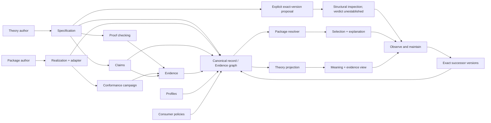

# Tracer system map

## Purpose and authority

This document is the revisable end-to-end map of the current system. It explains how
the product data plane, product decision plane, and project/agent control plane connect
across tracer increments. It is a derived orientation document: normative semantics
remain in the concern documents, accepted forks in ADRs, and live completion status in
the active ExecPlan.

| Question | Authoritative source |
|---|---|
| protected mission and product outcome | [constitution](../vision/constitution.md) |
| entities, identity, observation, Claims, Evidence, profiles, and policies | [core model](core-model.md) |
| proof/test/review/result/assurance distinctions | [evidence model](evidence-model.md) |
| semantic resolution versus directional interoperation | [compatibility](compatibility.md) |
| executable Stack process boundary | [adapter protocol](adapter-protocol.md) |
| work DAG, delegation, gates, and change profiles | [lifecycle](lifecycle.md) |
| Waves 1–4 node history, failures, evidence, and counts | [completed ExecPlan 0001](../exec-plans/completed/0001-tracer-bullet.md) |
| accepted actor-journey and governance successor history | [completed ExecPlan 0002](../exec-plans/completed/0002-actor-journeys.md) |
| deferred uninvolved-human inspection journey | [active ExecPlan 0003](../exec-plans/active/0003-cold-human-inspection.md) |
| accepted OrderedMap second-domain route | [completed ExecPlan 0004](../exec-plans/completed/0004-ordered-map-generality.md) |
| accepted differentiated deployment-profile route | [completed ExecPlan 0005](../exec-plans/completed/0005-deployment-profile-choice.md) |
| active shared human-authoring route | [active ExecPlan 0006](../exec-plans/active/0006-shared-human-authoring-surface.md) |
| completed explicit refinement-inspection route | [completed ExecPlan 0007](../exec-plans/completed/0007-explicit-refinement-inspection.md) |
| completed interaction-protocol route | [completed ExecPlan 0010](../exec-plans/completed/0010-retry-safe-lease-session.md) |

Current route: ExecPlan 0004 is closed at two-domain reuse. ExecPlan 0005 produced
fresh exact-profile Evidence and an authenticated 69-member authority for differentiated
native-process and Deno-sandbox choices. Its actor selects Rust only for the native
profile and TypeScript only for the Deno profile while retaining 21 nonmatching Claims
and 21 nonmatching Evidence records as inapplicable in each decision. Its lifecycle is
closed. The active authored route now turns the reviewed shared-authoring boundary into
one complete human PSpec journey.
The archived A1 candidate freezes the original two-domain authoring deficit: shared structural identity
and references are explicit, while hosted semantic payloads remain unchecked; the
illustrative Stack surface cannot round-trip without hidden rules and OrderedMap has no
surface. No grammar or authoring representation is selected before independent review.
The accepted A1 problem and A2 comparison feed an A-G2-accepted format-neutral
document-or-diagnostics boundary. A3 freezes its exact two-domain contract, and A4 now
implements the `canonical-spec-json-v1` control with strict raw phases, total
diagnostics, detached output, and a finite caller-supplied dependency context. It
performs no ambient discovery and succeeds only relative to that exact context.
Canonical JSON remains a control rather than the final human surface; hidden inference
and an unneeded second IR are rejected. Design-spec 0001 now drives a TOML-shaped,
lossless `pspec-toml-v1` adapter and explicit atomic author command across both domains.
Automated A5 controls pass; eligible uninvolved-author observation, A-R5, and A-G remain
open.
Stacked above that open gate, design-spec 0002 and ExecPlan 0007 now make one explicit
cross-version proposal inspectable across both exact successor shapes. The surface
reports only authored structural dispositions and keeps semantic refinement
unestablished; it adds no canonical relation, resolver behavior, or Evidence transfer.

## End-to-end product shape



Solid graph edges exist as executable bounded Stack tracer increments today. They cover
finite theory publication, independent package registration, one honest curated graph,
proof checking, child-process conformance, reviewed Rust/TypeScript Evidence, both
consumer projections, exact successor recovery, protected hosted release, and
fresh-clone reproduction. The graph-derived human inspection surface is executable,
but its uninvolved-human observation remains deferred and unobserved. The finite
OrderedMap tracer now traverses the same actor-complete lifecycle without changing the
accepted local Stack semantics. This is evidence of reuse across exactly two
structurally different domains, not arbitrary-domain generality.

For the tracer, **registry** means one curated finite local source set of immutable
exact-version records. It does not yet mean hosted acquisition, authentication,
indexing, version discovery, remote execution, or production registry security.

## System planes

### Product data plane

The data plane carries Specifications, Realizations, Claims, Evidence, profiles,
policies, proof artifacts, conformance requests/responses, observations, reports, and
exact typed references.

Its current executable runtime loop is:

```text
immutable conformance plan
  -> NDJSON adapter requests
  -> Realization observations and reported events
  -> declaration-level outcomes
  -> reproducible campaign report
```

The report is an observation artifact, not self-ratifying Evidence.

### Product decision plane

The product decision plane determines which data is coherent and what may be concluded:

- schemas and exact-address loading/linking;
- proof and conformance checkers;
- Claim/Evidence scope, provenance, and review binding;
- consumer policy and profile applicability;
- semantic resolution and directional realization compatibility;
- freshness, successor, retirement, and recovery rules.

The decision plane must bind a report to the exact Specification, Claim, Realization,
adapter, profile, plan, source, toolchain, review, assumptions, and exclusions before
it can contribute assurance. Graph validity remains distinct from evidence acceptance,
applicability, result, policy satisfaction, and selection.

### Project and agent control plane


The user owns protected intent. The lead frames dependencies, delegates bounded nodes,
assigns shared-surface integration, disposes concerns, and accepts convergence. Crew
members own their nodes and challenge affected nodes with evidence. Model identity or
reviewer status grants neither authority nor assurance.

Cross-provider children run through `agent-dispatch` with bounded sandbox, disclosure,
write scope, effort, and model provenance. With per-consultation operator authority,
Herdr may host a trusted read-only advisor in one named resumable session and dedicated
tab. That route is procedural rather than OS-enforced, is not a child capability or
sandbox assurance, and cannot perform writes or ratify a gate.

## Layers and present state

| Layer | Responsibility | State |
|---|---|---|
| L0 protected intent | mission, principles, non-goals, consumer authority | accepted governance; human authority |
| L1 semantic model | operations, observations, laws, protocols, effects, resources, profiles | bounded Stack, finite OrderedMap, and one finite lease-session protocol accepted |
| L2 canonical records | six immutable exact-version record kinds and typed references | executable |
| L3 graph integrity | schema, duplicates, dangling/wrong-kind references, coherent scope | executable |
| L4 local loading | deterministic finite source-set discovery and exact import edges | executable |
| L5 semantic Evidence | one named-law proof with exact model/tool/input provenance | executable and deliberately bounded |
| L6 realization execution | opaque-handle child adapter and event observation | executable under separate Stack and OrderedMap NDJSON protocols; one exact probe retains both event surfaces without making either normative |
| L7 independent conformance | exact harness-owned campaigns against Rust/TypeScript and breakers | executable for both domains without shared transition or oracle code; bounded non-effect projection equality is observable across four complete event variants |
| L8 Evidence binding | declaration-scoped Claims and exact-bound review/provenance fields | executable as eight accepted Stack records, 14 accepted base OrderedMap records, and 14 accepted exact-profile OrderedMap records; assurance remains policy-relative |
| L9 product registry | curated honest source sets distinct from fixture history | executable for exact Stack 24/31-record snapshots and OrderedMap 33/35/69-record snapshots |
| L10 resolution | policy/profile-relative semantic selection and interoperation explanation | executable for exact Stack, OrderedMap maintenance, and two differentiated-profile queries; semantic status stays separate from directional boundaries |
| L11 projections | theory and package consumer views derived from the graph | both bounded consumer views are graph-only and executable in both domains |
| L12 maintenance and evolution inspection | exact successors, explicit structural dispositions, staleness, withdrawal, failure recovery | executable for bounded Stack and OrderedMap snapshots; proposal-local cross-version reports remain unestablished, and OrderedMap `0.2.0` retains zero candidates plus exact nonautomatic `0.1.0` recovery; no accepted lineage, compatibility, migration, automatic selection, or freshness engine |

## Tracer increments

### Wave 1 — meaning and design closure

Defines top-first extensional Stack observation, empty behavior, `pop-push`, persistence,
reported effects, a bounded profile, and a deliberately unsupported performance
proposition. This prevents a later Realization or test harness from silently defining
the semantic contract.

### Wave 2 — canonical graph

Introduces Specification, Realization, Claim, Evidence, RealizationProfile, and
ConsumerPolicy records with exact `(kind, id, version)` identity. Link validation
separates invalid graphs from coherent but inapplicable Evidence.

### Wave 3 — local loading, execution, and proof substrate

Loads one finite local source set with stable diagnostics; exposes the Python reference
Realization through `stack-runner-json-v1`; and checks one Lean proof for `pop-empty`.
The harness owns expected traces, the adapter owns translation, and the Realization
owns its private representation. The proof supports only the named proposition under
its recorded model and assumptions.

### Wave 4 — hardened campaign and independent Realizations

Freezes a declaration-granular campaign, adds protocol-correct negative packages, and
checks independently represented Rust and TypeScript Stacks. Exact binding turns the
reviewed outcomes into eight bounded Evidence records. It does not establish general
JSON handling, adapter faithfulness, performance, concurrency, remote operation, or
Rust/TypeScript interoperation.

### Wave 5 — actor-complete product slices

The acceptance DAG defined in the [four actor journeys](user-journeys.md) is executable
through its maintenance successor:

```text
vocabulary and local boundary
  -> theory-author publication
  -> independent package registration
  -> one honest curated graph
  -> package resolution || theory browse/import
  -> successor/staleness recovery
  -> journey-complete release
```

The release edge is accepted: protected hosted governance and the operator's independent
fresh-clone reproduction both passed. The next plan separately tests whether an
uninvolved human can understand the graph-derived consumer output.

### OrderedMap — second-domain lifecycle

ExecPlan 0004 carries one finite OrderedMap through representation-independent
authoring, a separately owned profile and policy, independent Rust and TypeScript
packages, harness-owned bounded conformance, declaration-scoped Evidence, exact
publication and registration, package/theory consumer views, a selective reorder
breaker, and append-only maintenance. The accepted `0.1.0` graph resolves both
Realizations; the exact `0.2.0` successor adds `size`/`size-put` but no Realization,
Claim, or Evidence, so its honest query returns zero candidates while retaining
historical predecessor Evidence and nonautomatic recovery.

### OrderedMap — exact deployment-profile choice

ExecPlan 0005 extends the O8 graph append-only with two profiles, two unchanged-strength
policies, and two fresh 15-record package sets. Fresh native and Deno campaigns bind
the same OrderedMap meaning to different exact deployment envelopes. One authenticated
actor makes both decisions from the 69-member graph: Rust `0.2.0` under the native
profile and TypeScript `0.2.0` under the Deno profile. Each decision exposes seven
selected and 21 inapplicable Claims plus the same Evidence ledger; optional performance
remains unsupported. The directional child-process boundary is reported separately
and does not grant semantic acceptance.

### Exact-version refinement inspection

Design-spec 0002 and ExecPlan 0007 add one reversible maintenance precursor above the
two accepted successor pairs. An explicit proposal binds both exact Specification raw
digests and disposes every declaration as mapped, added, or removed. Stack reports ten
unchanged mappings plus one changed effect contract; OrderedMap reports eighteen
unchanged mappings plus two additions. The report order is proposal authority and the
conclusion remains `unestablished`. This is reusable structural mechanics across two
examples, not an accepted semantic refinement edge or arbitrary-domain generality.

### Bounded effect-separation observation

Design-spec 0003 and ExecPlan 0008 compose the existing exact Stack and OrderedMap
runners without changing their plans, fixtures, reports, or authority. Five retained
variants per domain keep native semantic projections, ordered adapter-event ledgers,
effect outcomes, and execution errors distinct. Optional, forbidden, and unspecified
complete projections equal the quiet projection; only each exact effect declaration
challenges for forbidden `io.read`. Error partials remain visible and nonauthoritative.
The probe publishes one atomic deterministic report, not Evidence or a resolver input.
Its conclusion is bounded to adapter-reported invocation events and two exact campaigns.

### Finite resource-composition inspection

Design-spec 0004 and ExecPlan 0009 add one theory-author edge above the two retained
Specifications. A new PSpec imports exact Stack and OrderedMap, defines a four-element
resource-local carrier and all sixteen ordered composition rows, and binds the two
distinct `persistence` declarations explicitly. Four caller-named context records keep
both imported Specifications link-valid without discovery. The inspector checks
closure, totality, unit, commutativity, and associativity, then publishes complete
authored-order and reverse-order fold traces atomically.

The report's conclusion is only `finite-algebra-well-formed`; satisfaction is fixed at
`unestablished`. It creates no Claim, Evidence, compatibility, refinement, resolver or
consumer decision, runtime-resource composition, ownership/separation result, or
arbitrary-domain resource foundation. Existing Stack and OrderedMap source, records,
runners, Evidence, and product decisions remain unchanged.

### Retry-safe lease-session interaction protocol

Design-spec 0005 and ExecPlan 0010 add an optional finite labelled-transition shape and
one exact nine-record package graph. A campaign starts an isolated child process for
each of six scenarios against table-oriented, object-oriented, and resurrection-breaker
candidates. Complete traces retain every input, output, before/after state, and opaque
identity. Two accepted Evidence records satisfy the exact required concern; the breaker
is challenged at late completion after expiry. Semantic decisions and directional
NDJSON process boundaries are separate report fields.

The conclusion is only `bounded-protocol-package-observed`. Explicit campaign expiry is
not a timer claim, and the package establishes no liveness, concurrency, partition,
crash-recovery, token-security, exhaustive-trace, refinement, composition, session-type,
or arbitrary-domain result.

## Actor data flows

| Actor | Data-plane path | Current edge |
|---|---|---|
| theory author | semantic source -> canonical Specification/Claim -> exact-version proposal -> resource composition -> structural inspection -> graph checks -> proof or other Evidence | explicit Stack and OrderedMap PSpec authoring, two-domain refinement inspection, and one finite cross-domain resource composition are experienceable; automated checks pass, while uninvolved-author acceptance, hosted publication, semantic refinement, resource satisfaction, and hosted semantic checking remain absent |
| package author | Realization/adapter -> explicit build -> campaign -> bounded effect-separation observation -> report -> reviewed declaration Evidence -> graph | executable for independently represented Rust and TypeScript packages in both domains; the cross-domain probe is inspectable but creates no Evidence |
| package consumer | Specification + policy + profile -> Evidence selection -> semantic result -> boundary mechanism | executable exact Stack and OrderedMap queries plus one bounded lease-session package query; Evidence decisions remain separate from directional child-process boundaries |
| theory consumer | exact Specification -> declarations/imports -> Claims/Evidence/unknowns -> derived view | executable Stack and OrderedMap projections; realization-scoped Evidence never becomes Specification assurance |

## Trust boundaries

| Boundary | Current protection | Retained trust or gap |
|---|---|---|
| record files -> graph | strict schemas, deterministic loading, exact link checking, phase barriers | assumes a quiescent local filesystem; no signatures or hosted provenance |
| proof source -> Evidence | exact manifest/input/tool binding and Lean kernel execution | semantic translation into Lean remains reviewed; checker and pinned kernel join the TCB |
| Realization -> observation | untrusted child, exact framing, harness-owned expectations, exact domain-owned projection/ledger binding | adapter faithfulness and reported-event completeness remain assumptions; external effects and arbitrary contexts remain excluded |
| report -> Evidence | fresh reproduction and exact Claim/Realization/source/tool/report/review binding | tracer-specific acceptance checker; no general resolver or cryptographic reviewer identity |
| registry metadata -> execution | build and child argument vectors are explicit gate inputs | no registry-driven build, discovery, or execution edge exists by design |
| canonical graph -> projection | projections must derive from one explicitly selected snapshot | both consumer views and maintenance comparison are graph-only and non-executing; no hosted browser/UI boundary yet |
| lead -> delegated child or advisor | dispatcher depth/sandbox for children; isolated writes; disclosure/provenance packets; per-consultation authority and named-tab continuity for Herdr advice | most DAG authority and concern disposition remains documentary; a Herdr advisor is trusted/procedural and never equivalent to a sandboxed child |

The UI, Realizations, adapters, authored Claims, unreviewed reports, and agent assertions
are not inherently trusted. Trust-sensitive components include schema/link checking,
the conformance oracle and frozen plan, selected proof kernel, provenance binding, and
the bounded Stack resolver.

## Nested lifecycles

### Artifact and Evidence lifecycle

```text
author -> validate -> link -> publish exact immutable version
                                   |
                                   +-> publish successor; retain predecessor

Claim:    draft -> active -> retired | withdrawn
Evidence review: unverified -> pending -> accepted | rejected -> superseded | revoked
Evidence result: supports | challenges | inconclusive | error
```

Claim lifecycle, Evidence review, Evidence result, applicability, and derived assurance
remain independent axes. An accepted counterexample may challenge an active Claim.

### Evidence production lifecycle

```text
frame Claim and profile
  -> choose evidence mechanism
  -> prove / test / measure / audit
  -> retain raw output and provenance
  -> author a valid Evidence record with explicit review state
  -> independent review produces an accepted/rejected successor disposition
  -> policy selection and derived assurance
  -> reopen when governing input, tool, review, or version changes
```

### Project change lifecycle

```text
intent/classification -> baseline/falsifier -> design/risk -> realization
  -> evidence -> convergence/release -> learning/maintenance -> successor
```

The default bounded implementation loop is refute-first and uses
red–green–refactor where meaningful. Security containment, characterization-based
refactors, measured optimizations, proof obligations, migrations, and governance
experiments use their explicit evidence profiles rather than artificial unit-test
steps.

## Material boundaries and reopen triggers

- local source-set validity is not product publication, assurance, or resolution;
- bounded conformance is not universal verification or adapter faithfulness;
- bounded projection equality under four retained event variants is not whole-process
  purity, arbitrary effect erasure, semantic equivalence, or contextual noninterference;
- shared adapter protocol conformance is not cross-language interoperability;
- accepted Evidence is mechanism-, profile-, version-, and policy-relative;
- exact profile choice does not imply profile refinement, Evidence migration, runtime
  interoperability, or version compatibility;
- descriptive Realization entrypoints cannot become automatic execution instructions;
- unsupported performance propositions remain visible through current resolvers and
  graph projections; a hosted browser remains absent;
- `.pspec` elaboration is executable only through design-spec 0001's explicit finite
  dependency context; hosted semantics and publication remain outside that boundary;
- exact-version staleness and same-snapshot recovery are executable for the bounded
  Stack and OrderedMap successors; time freshness, lineage, automatic migration, and
  compatibility-relative supersession remain absent; proposal-local structural
  inspection does not close any of those gaps;
- the local repository gate alone is not a release gate; hosted CI now provisions every
  pinned Python, Lean, Rust/linker, and Deno dependency and must remain green alongside
  protected squash policy and fresh-checkout evidence.

Any change to one of these boundaries reopens the affected downstream layers and the
corresponding actor journey.
