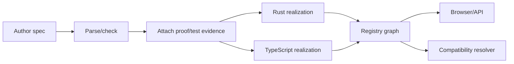

# Tracer-bullet design

## Goal

Demonstrate the entire lifecycle with one small specification and two independent realizations.

## Candidate domain

Start with `Stack[A]` for the thinnest slice, then graduate to `OrderedMap[K,V]` when the pipeline works. Stack is not the ultimate demonstration; it minimizes semantic complexity while forcing every system boundary to exist.

## Required end-to-end behaviors

1. Load canonical, versioned records with pinned references and useful diagnostics.
2. Identify operations, observations, laws, effects, resources, profiles, and claims.
3. Define extensional Stack observation, including empty-pop behavior, without
   prescribing either realization's representation.
4. Machine-check one proof artifact for a named law and record the checker,
   assumptions, inputs, and result.
5. Run one reusable conformance/property suite against both realizations and reject a
   deliberately broken realization with a useful counterexample.
6. Exercise the persistence resource rule by observing both the old and new logical
   stacks, and expose the adapter-observed effect trace.
7. Register language/runtime/ABI metadata and the adapter used by each realization.
8. Browse the specification, realizations, profiles, claims, supporting and
   challenging evidence, unknowns, and exclusions.
9. Explain semantic substitutability relative to a policy/profile separately from the
   directional boundary mechanism needed for interoperation.

The `amortized_O(1)` declaration remains visible even if the tracer bullet does not
yet supply acceptable performance evidence. That is a required demonstration of an
unknown or assertion-only concern, not permission to report the claim as verified.

The named-law proof uses a specification-subject claim and therefore omits realization
and adapter references. Realization conformance uses separate realization-subject
claims whose evidence pins the executed adapter. Evidence always pins the governing
specification; redundant scope that disagrees with the claim is invalid rather than
merely inapplicable.

## Falsification fixtures

The vertical slice includes negative cases, not only a happy path:

- a dangling or version-mismatched reference rejected by the loader;
- duplicate typed record addresses, wrong-kind references, duplicate local declaration
  IDs, and incoherent claim/evidence scope rejected by the link checker;
- a non-`None` empty-pop result and a bottom-first observation rejected;
- a fresh but extensionally equal remainder accepted, proving handle identity is not
  part of Stack equality;
- a Stack realization that violates `pop_push`;
- a realization that mutates or invalidates the old stack after `push`;
- a destructive `pop` that invalidates a retained stack;
- an adapter-observed forbidden event rejected while an unobserved external event is
  retained as an explicit exclusion rather than reported absent;
- a lying adapter demonstrating why adapter correctness is an explicit assumption or
  separately evidenced claim;
- evidence whose subject or profile does not match the claim;
- accepted supporting and challenging evidence producing a visible contested result;
- assertion-only evidence failing a required concern when assertions are not accepted;
- two realizations that are semantically acceptable but require a non-direct boundary;
- realizations that can communicate but fail a required evidence policy.

## Deferred choices

- final surface syntax;
- universal proof assistant;
- general synthesis;
- arbitrary logic combination;
- production registry security;
- sophisticated cost estimation.
