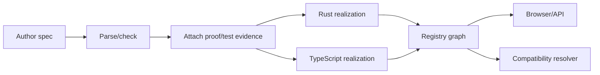

# Tracer-bullet design

## Goal

Demonstrate the entire lifecycle with one small specification and two independent realizations.

## Candidate domain

Start with `Stack[A]` for the thinnest slice, then graduate to `OrderedMap[K,V]` when the pipeline works. Stack is not the ultimate demonstration; it minimizes semantic complexity while forcing every system boundary to exist.

## Required end-to-end behaviors

1. Parse a versioned specification.
2. Identify operations, laws, effects, resources, and claims.
3. Associate at least one machine-checked proof or proof artifact with a law.
4. Run a reusable conformance/property suite against both realizations.
5. Register language/runtime/ABI metadata.
6. Browse the specification, realizations, claims, evidence, and exclusions.
7. Explain whether two selected realizations are semantically substitutable and how they can interoperate.

## Deferred choices

- final surface syntax;
- universal proof assistant;
- general synthesis;
- arbitrary logic combination;
- production registry security;
- sophisticated cost estimation.
