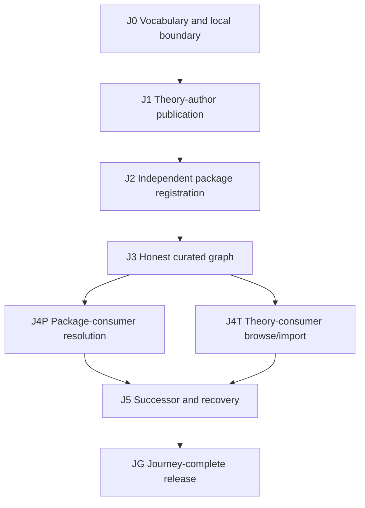

# Tracer user journeys

## Purpose

The tracer is complete only when four actors can finish bounded tasks against the
same canonical records. J1–J5 make those four terminal outcomes and bounded maintenance
executable; JG accepted hosted release convergence and independent fresh-checkout
reproduction. ExecPlan 0003's automated human-inspection surface passes while its real
uninvolved-human observation remains deferred. ExecPlan 0004 now tests whether these
contracts survive a structurally different OrderedMap domain without retroactively
changing them. They are not personas or a promise of hosted infrastructure.

For this tracer, a **registry** is one curated finite local source set of immutable,
exact-version records. To **publish** or **register** is to add records to that set and
pass its schema, link, provenance, and product-graph gates. Browse and resolution are
derived projections; they never become a second source of truth. Remote acquisition,
authentication, databases, production search, and registry security remain excluded.

## Actors and terminal outcomes

| Actor | Owns | Terminal outcome |
|---|---|---|
| theory author | versioned Specifications and specification-scoped Claims/Evidence | publishes an exact semantic artifact whose declarations, proof boundary, assumptions, exclusions, and failures can be checked and found |
| package author | Realizations, adapters, and realization-scoped Claims/Evidence | independently registers a bounded implementation whose support and limits reproduce without making its representation normative |
| theory consumer | exact Specification selection and import inspection | browses meaning, declarations, proof state, unknowns, and exact import edges without requiring an executable Realization |
| package consumer | profile, policy, realization selection, and deployment boundary | receives an explainable selected/unmet/contested result with semantic acceptability separated from directional interoperation |

An actor may occupy more than one role. The role names authority over artifacts and
the observation needed to finish a task; they do not form a hierarchy.

## Acceptance DAG



J4P and J4T may proceed in parallel because both consume J3 without owning its
canonical records. A changed predecessor reopens affected downstream acceptance and
creates a successor node; it does not rewrite a previously observed result.

## Journey contracts

### J0 — vocabulary and local boundary

Acceptance requires the actor definitions above; distinct observations for publish,
register, browse, resolve, and consume; exact local record identity; and explicit
hosted-infrastructure exclusions. No implementation may silently reinterpret
`fixtures/records/valid/` as the product registry because that tree also contains
validation history.

### J1 — theory author publishes Stack

The theory author creates exact Stack Specification, specification-Claim, and
proof-Evidence records and attempts to add them to the curated source set. The selected
profile and policy remain consumer-owned inputs; if the same person also authors them,
that is a separate package-consumer role. Acceptance requires:

- the curated source set loads with zero diagnostics and exposes exact addresses and
  content provenance;
- the named-law proof reproduces with its checker, assumptions, and exclusions;
- duplicate addresses, wrong versions, malformed records, and dangling references
  fail with stable diagnostics;
- the provisional `.pspec` syntax is not presented as executable authoring until an
  elaborator exists.

The accepted tracer slice performs read-only inspection of the finite Stack theory
source set, rejects hidden or unexpected records without following symlinks, exact-binds
the four curated records, and reproduces the named Lean proof. Hosted publication,
acquisition, discovery, and general authoring remain outside this edge.

### J2 — package authors register independent Realizations

For Rust and TypeScript independently:

- the author starts from the exact Specification, profile, and adapter contract rather
  than another Realization or the harness transition model;
- build, protocol lifecycle, and the shared exact campaign pass;
- law- and persistence-breaking controls challenge only their intended declarations;
- Realization, Claim, Evidence, source, toolchain, plan, report, profile, review,
  assumption, and exclusion bindings reproduce from the repository gate;
- a green report alone is never treated as accepted Evidence.

Wave 4 closes the bounded implementation, campaign, and Evidence-binding substrate.
J2 registers both exact package packets with actor-owned roles in the curated product
source set, rejects missing, unexpected, moved, aliased, or mutated inputs, and retains
explicit build/campaign reproduction as Evidence rather than registry-driven execution.

### J3 — converge one honest graph

One curated local source set contains the 22 accepted theory/package records plus one
package-consumer-authored policy and one theory-author-authored composition
Specification that imports exact Stack. A theory consumer selects and inspects that
Specification; authoring it is a separate role. The supplied profile remains a
dependency until a consumer selects it; the graph integrator does not author either
consumer decision. Declaration-scoped Claims/Evidence, proof Evidence, and the
intentionally unsupported performance concern remain visible. Obsolete fixture-only
support stays available as test history but outside the product graph. Every projection
and resolver obtains canonical records from this source set while its actor still
selects explicit exact policy, profile, or Specification inputs. One command validates
the whole graph.

### J4P — package consumer resolves under policy

The bounded query shows candidate exact versions and, for every required concern, the
selected supporting, challenging, inconclusive, missing, or inapplicable Evidence.
Required laws, resources, and effects are disposed explicitly. Unsupported performance
remains visible but non-blocking when optional. Semantic acceptability is reported
separately from directional process-boundary interoperation. The fixtures include both
an operationally composable but semantically unacceptable candidate and a semantically
acceptable candidate that needs a non-direct boundary.

### J4T — theory consumer browses and imports

The projection shows exact Stack identity, declarations, import edges,
specification-scoped Claims/Evidence, assumptions, exclusions, contradictions, and
unknowns. A consumer can follow stable declaration, Claim, and Evidence references
without array-position meaning. A second local Specification demonstrates an exact
Stack import; a missing import fails. No namespace merge, acquisition, compatibility,
refinement, or declaration lineage is inferred.

### J5 — maintain versions and recover from failure

An exact successor is introduced without mutating its predecessor. Old artifacts and
failed or contradictory Evidence remain browsable. Evidence scoped to an old exact
version cannot satisfy a new Claim silently, and changed governing inputs make prior
acceptance stale until rerun. Claim retirement or withdrawal remains distinct from
Evidence result and review. A failed successor leaves the last acceptable exact version
selectable and explainable. No semantic-version compatibility or declaration lineage
is inferred.

### JG — journey-complete release

One documented fresh-clone gate validates the curated graph, reproduces the proof and
both independent campaigns, replays negative controls, resolves the package-consumer
query, renders or queries both consumer projections, and exercises successor/staleness
failure. The gate retains exact commands, inputs, outputs, assumptions, exclusions,
and known recovery limits.

## Scenario evidence map

Every scenario is recorded as:

```text
actor need -> journey ID -> canonical inputs -> command/API
           -> expected observation -> retained Evidence/exclusions -> reopen trigger
```

Implementation work packages may be smaller than a journey, but a tracer feature is
not accepted merely because its internal packages are green. Its downstream journey
must reach the actor's terminal outcome.
